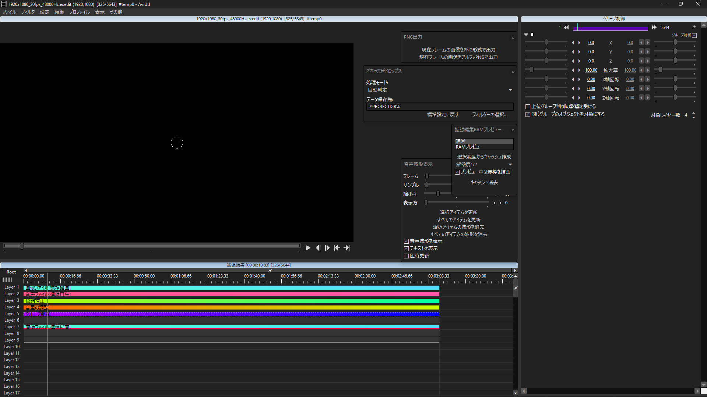

# minaDarkのダウンロード

こんにちは。意味不明なブログの更新頻度ですね。

## 概要
patch.aulとDarkenWindow.aulを組み合わせてエディターの見た目を変えるパッケージ。


## 導入方法
①テキストエディタ(メモ帳など)を使用して，patch.aul.json(partipal).txtを開きます。

②AviUtlフォルダもしくはPluginsフォルダにあるpatch.aul.jsonも同様にテキストエディタで開いてください。

③①で開いた```patch.aul.json(partipal).txt```の内容をすべてコピーし，②で開いたpatch.aul.jsonの6行目あたりにある```"layer" : {```から30行目あたりにある```}```までを選択し，そのままクリップボードからペーストしてください。

通常であれば上書きされます。上書き保存して２つのエディタを閉じてください。
④あとは簡単です。パッケージ内にあるminaDarkフォルダ，minaDark.xmlを```(AviUtlのフォルダ)\(Plugins\)DarkenWindow\Skin```に配置します。

## 注意事項
・付属のreadme.txtは読んでください。

・このパックはpatch.aul，DarkenWindowに記載されている禁止事項・免責事項をすべて継承します。

## ダウンロード

以下のリンクからDLできます。

[minaDark - DarkenWindow6.x.x.zip](minaDark%20-%20DarkenWindow6.x.x.zip)