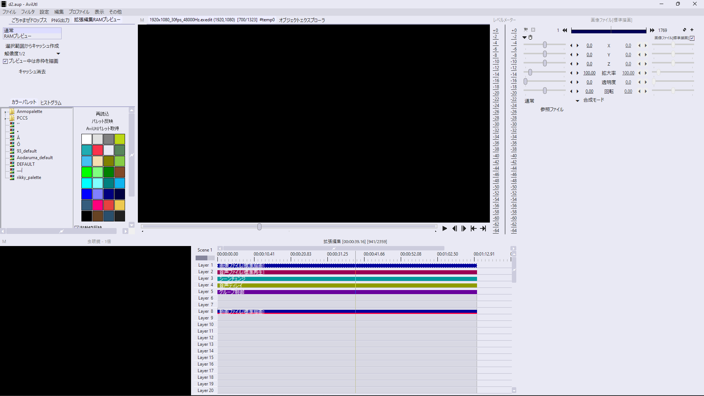
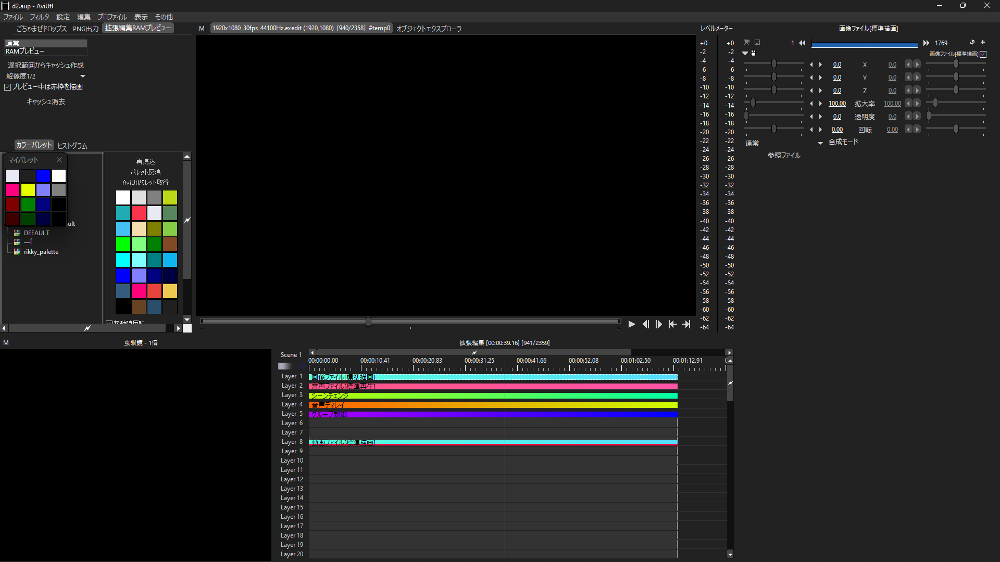

# 黒窓プラグイン用スキン

最近AviUtlの見た目を
[黒窓プラグイン](https://github.com/hebiiro/AviUtl-Plugin-DarkenWindow)
を使用して変更できるようになりました。このページでは，見た目を変えるのに使用するスキンを配布しています。

## 概要
patch.aulとDarkenWindow.aulを組み合わせてエディターの見た目を変えるパッケージ。


## 導入方法
① テキストエディタ(メモ帳など)を使用して，patch.aul.json(partial).txtを開きます。

② AviUtlフォルダもしくはPluginsフォルダにあるpatch.aul.jsonも同様にテキストエディタで開いてください。

③ ①で開いた```patch.aul.json(partial).txt```の内容をすべてコピーし，②で開いたpatch.aul.jsonの6行目あたりにある```"layer" : {```から30行目あたりにある```}```までを選択し，そのままクリップボードからペーストしてください。

通常であれば上書きされます。上書き保存して２つのエディタを閉じてください。

④ あとは簡単です。パッケージ内にあるminaDarkフォルダ，minaDark.xmlを```(AviUtlのフォルダ)\(Plugins\)DarkenWindow\Skin```に配置します。

## 注意事項
・付属のreadme.txtは読んでください。

・このパックはpatch.aul，DarkenWindowに記載されている禁止事項・免責事項をすべて継承します。

## ダウンロード

以下のリンクからDLできます。

#### minaDark

最新版:[minaDark - DarkenWindow6.5.3~.zip](minaDark%20-%20DarkenWindow6.5.3~.zip)

#### minaLight

最新版:[minaLight - DarkenWindow6.5.3~.zip](minaLight%20-%20DarkenWindow6.5.3~.zip)

## 古いバージョンはこちら

#### minaDark

[minaDark - DarkenWindow6.5.x~.zip](minaDark%20-%20DarkenWindow6.5.x~.zip)

[minaDark - DarkenWindow6.x.x.zip](../Blog/minaDark%20-%20DarkenWindow6.x.x.zip)

#### minaLight

minaLightの過去バージョンはまだありません。